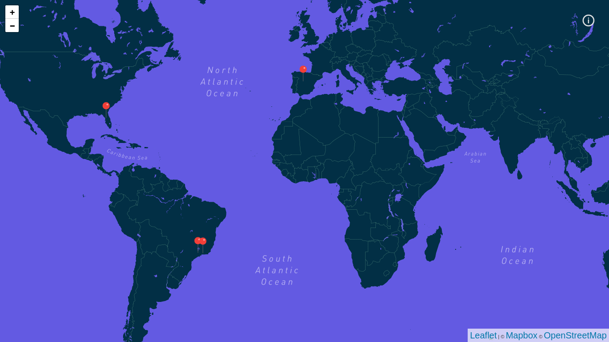
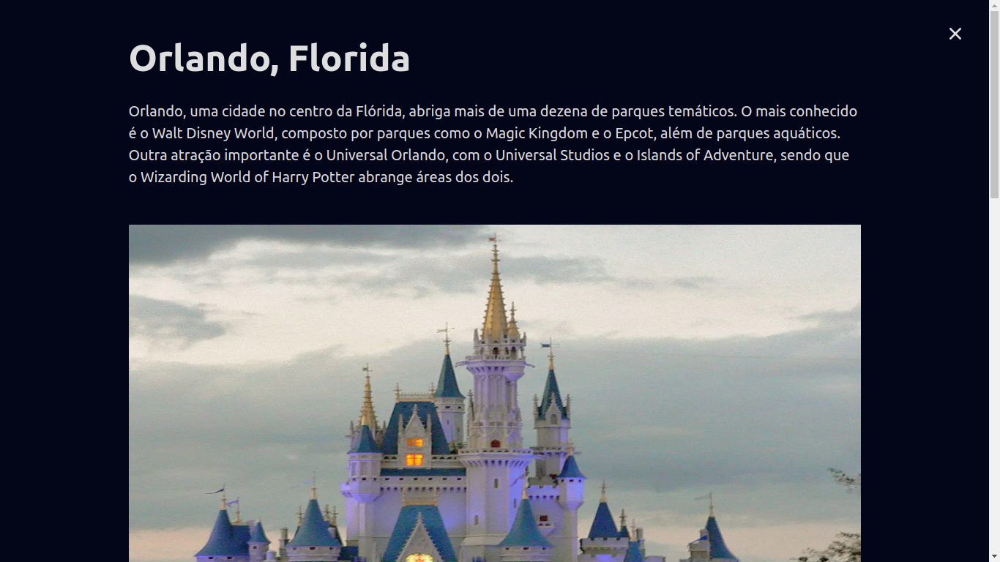

<h1 align="center"> <strong>🗺️TravelMap</strong></h1>

<p align="center">


</p>

<br />
<p align="center"></p>
<p align="center"></p>


<br />

# 📕 About

</br>

# 🛠️Technologies 
This project was made using the follow technologies:

- [TypeScript](https://www.typescriptlang.org/)
- [React](https://reactjs.org)
- [NextJS](https://nextjs.org/)
- [GraphQL](https://graphql.org/)
- [GraphCMS](https://graphcms.com/)
- [Leaflet](https://react-leaflet.js.org/)

# 🏃Getting Started
```sh
#  Clone Repository
$ git clone  https://github.com/wesleywcr/TravelMap.git
```
```sh
# Install Dependencies
$ yarn install
# Start application
$ yarn dev
```
# 📝License

Released in 2022.
This project is under the [MIT license](./LICENSE)

Made with ❤️ by [Wesley Rodrigues](https://github.com/wesleywcr)🤙👊